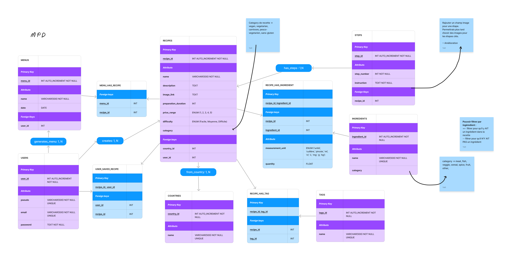
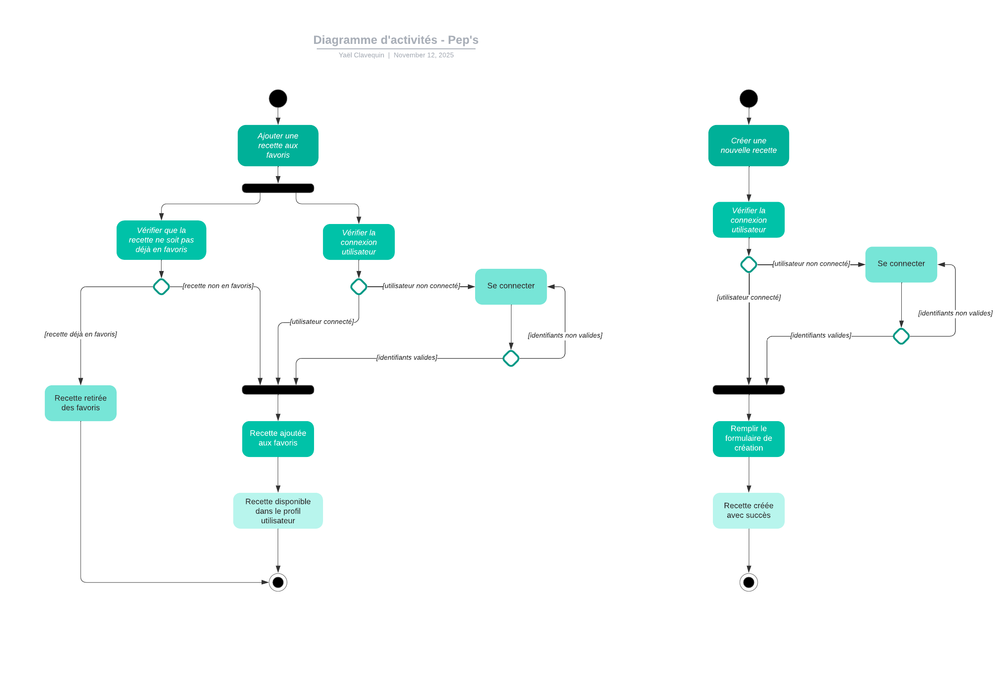

# 🥗 Pep’s

**Pep’s** est une application web qui permet de découvrir et planifier des recettes de cuisine pour chaque jour de la semaine.  
L’objectif : simplifier la création de menus équilibrés et inspirants au quotidien, tout en rendant la planification des repas agréable et intuitive.

---

## 🧭 Sommaire

1. [🌿 Présentation](#🌿-présentation)
2. [📊 Diagrammes](#diagrammes)
3. [📁 Structure du projet](#📁-structure-du-projet)
4. [🔧 Technologies utilisées](#️🔧-technologies-utilisées)
5. [⚙️ Installation et configuration](#⚙️-installation-et-configuration)
6. [🚀 Lancement du projet](#🚀-lancement-du-projet)
7. [🏗️ Architecture des services](#🏗️-architecture-des-services)
8. [🤖 Intégration continue (CI)](#🤖-intégration-continue-ci)
9. [🧪 Tests](#🧪-tests)
10. [🗺️ Roadmap](#🗺️-roadmap)


## 🌿 Présentation

Pep’s permet de :
- Créer un menu hebdomadaire avec des recettes variées.
- Consulter des recettes de cuisine selon les jours de la semaine.
- Planifier ses repas et **bientôt** générer automatiquement une liste de courses.

Le projet vise à devenir un outil pratique pour mieux manger, économiser du temps et éviter le gaspillage alimentaire.

## 📊 Diagrammes

### Modèle de BDD Merise



### Diagramme d'Activité



### Diagramme de Cas d'utilisation


### Diagramme de Séquence

### Diagramme de Classe


## 📁 Structure du projet

Le projet est organisé en **monorepo** avec une séparation claire entre le front-end et le back-end.

```
peps/
├── api/            # Backend (Spring Boot 3, Java 21)
├── client/         # Frontend (Angular 20)
├── .github/        # Workflows GitHub Actions (CI)
├── docker-compose.yml
└── .env.sample
```


## 🔧 Technologies utilisées

| Composant | Stack |
|------------|--------|
| **Frontend** | Angular 20, TypeScript |
| **Backend** | Spring Boot 3 (Java 21) |
| **Base de données** | PostgreSQL 16 |
| **CI/CD** | GitHub Actions |
| **Conteneurisation** | Docker & Docker Compose |


## ⚙️ Installation et configuration

### 1. Prérequis

- [Docker](https://www.docker.com/)
- [Docker Compose](https://docs.docker.com/compose/)
- (optionnel) [Java 21](https://adoptium.net/) et [Node.js 22+](https://nodejs.org/) pour lancer les services séparément

### 2. Cloner le Projet

```bash
git clone https://github.com/2024-devops-alt-dist/YC-peps-app.git
cd YC-peps-app
```

### 3. Configuration des variables d’environnement

Crée un fichier `.env` à la racine du projet à partir du modèle fourni :

```bash
cp .env.sample .env
```

Exemple du contenu :

```bash
PORT=8080

# DB

DB_URL=

DB_HOST=postgres
DB_PORT=5432
DB_USER=user
DB_PASSWORD=password
DB_NAME=database

# Hibernate
SPRING_PROFILES_ACTIVE=dev
```


## 🚀 Lancement du projet en local

Le projet peut être lancé localement avec **Docker Compose** :

```bash
docker compose up --build
```

Une fois le build terminé :

| Service               | URL locale                                                           |
| --------------------- | -------------------------------------------------------------------- |
| **Frontend**          | [http://localhost:4200](http://localhost:4200)                       |
| **Backend**           | [http://localhost:8080](http://localhost:8080)                       |
| **Base de données**   | `localhost:5432`                                                     |
| **Route de test API** | [http://localhost:8080/api/health](http://localhost:8080/api/health) |

### Docker Compose 🐋

Les trois services principaux sont :

* **postgres** → base de données PostgreSQL 16
* **api** → API Spring Boot
* **client** → application Angular

## 🏗️ Architecture des services

### 🖥️ Backend (`/api`)

* Framework : **Spring Boot 3 (Java 21)**
* Base : **PostgreSQL 16**
* Profils : `dev` et `prod`
* Cible Docker :

  * `dev` → exécution locale avec `localhost`
  * `prod` → build pour déploiement distant

Routes actuellement disponibles :

* `GET /api/health` → Vérifie la santé de l’API

---

### 💻 Frontend (`/client`)

* Framework : **Angular 20**
* Mode : standalone (sans `AppModule`)
* Scripts :

  ```bash
  npm start      # mode dev
  npm run build  # build de production
  ```
* Cible Docker :

  * `dev` → exécution avec `npm start`
  * `prod` → build statique du front


## 🤖 Intégration continue (CI)

Le workflow GitHub Actions (`.github/workflows/ci.yml`) automatise la vérification du projet à chaque push ou pull request.

[](https://github.com/LeighDraws/peps-app/actions/workflows/ci.yml)

### 🧩 Les 4 jobs principaux :

| Job          | Description                                                                                   |
| ------------ | --------------------------------------------------------------------------------------------- |
| **backend**  | Installe les dépendances Maven, exécute Spotless, les tests unitaires et un audit de sécurité |
| **frontend** | Installe Node.js, installe les dépendances, lance le linter et le build Angular               |
| **docker**   | Build l’image Docker du backend puis celle du frontend                                        |
| **notify**   | Envoie une notification dans la console GitHub Actions en cas d’échec                         |


---

## 🧪 Tests

 **Backend** \
 Lancer les tests unitaire du back avec Mockito et JUnit 5, pour le moment vide :

  ```bash
  cd api
  mvn test
  ```
 **Frontend** \
 Lancer les tests unitaires avec Karma et Jasmine, pour le moment vide :

 ```bash
 cd client
 npm test
 ```

 Lancer les tests e2e avec Playwright dans une nouvelle fenêtre (UI activé):

  ```bash
  cd client
  npm run test:e2e
  ```


## 🗺️ Roadmap

[ ] Déploiement \
    - ✅ BDD Neon \
    - ✅ API Render \
    - [ ] Vercel


